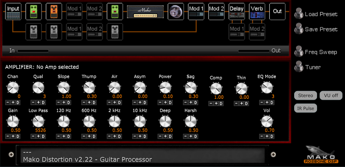

# Mako Distortion 2
* JUCE VST guitar processor.
* Tested on Windows only.
* Written in Visual C++ 2022.
* Version: 2.22
* Posted: January 7, 2024

VERSION
------------------------------------------------------------------
2.22 - Initial release.  
       
SUMMARY
------------------------------------------------------------------
A Juce/C++ VST3 guitar processor. Complete end to end processing
abilities like effects, amplifiers, EQ, etc.

This VST is under constant development and changes daily. 

THINGS TO KNOW
------------------------------------------------------------------
VST LIMITATIONS 
VST's do not save strings variables. This means things like IR
files, WAVE files, etc used in the VST will NOT BE AVAILABLE
from within the DAW at startup or its presets. 

MD2 PRESETS 
The best way to use MD2 is to load and save presets within the VST.
The preset files save any custom IR data in them.

SIGNAL PATH
------------------------------------------------------------------
INPUT BLOCK 
The guitar signal begins being processed at the INPUT block. It then
moves left to right on the VST diagram. The input block has settings
for high pass filter, Attack, and Noise Gate.

Attack is used for creating Pad/Violin effects and will gradually turn
the signal volume up after a silent moment in the playing. 

The Noise Gate turns the volume down while not playing. Adjust until
no noise is heard when not playing.

PEDAL BLOCKS 
There are six possible pedal locations. These are used for things like
OverDrive, Distortion, and other gain based effects.

MODULATION BLOCKS 
There are only two available mod effects that can be used at one time. 
These blocks can be located in three different locations: before amp,
after amp, or in the effect path of a reverb/delay block.

AMPLIFIER BLOCK 
The amplifier has 31 possible channel settings. There are 30 amplifiers
and one bypass channel (0). 

IMPULSE RESPONSE (IR) BLOCK 
An Impulse Response is a wave file the captures the frequency response
of a system. Here they represent the speaker being used by the amplifier
block. There are adjustements here for bass/treble balance (voice) and
resampling of the IR (Size).

There are 20 programmed IRs built in to the VST. External IRs can be loaded
by selecting IR 20 or using the LOAD IR button. Loaded IRs can be resampled.
The VOICE option mixes the IR with a full frequency IR. So only brightness
can be added.

DELAY AND REVERB BLOCKS 
These effects are fixed at these positions. The effects are always "ON".
To bypass the effect set its MIX value to 0 (zero).

OUTPUT BLOCK 
The final block has controls for balance, stereo effect, and output filters. 
The stereo effect (WIDTH) will delay either the left or right channel to
create stereo. 

STEREO/MONO SIGNAL PATH 
------------------------------------------------------------------
The IR calculations are very CPU intensive. This means the best mode
to operate in is MONO. This is the default mode. In this mode the signal 
on the top row of the VST diagram is mono from input to IR. The signal 
is stereo after the IR. If a stereo modulation effect is desired, place
it after the amplifier block.

When running in STEREO mode, the entire VST is in stereo. This is very CPU
intensive. There can be up to four IRs being calculated at one time. One
for input EQ and one for Speaker sim on both left and right channels. This is
1000's of calculations for each sample of the audio data.

AMPLIFIER BLOCK
------------------------------------------------------------------
The amplifier setion has 30 amps programmed. These amps can be adjusted
using the various controls. 

QUALITY 
Each amplifier uses a 1024 sample IR for its frequency definition. IRs
are very CPU intensive. Changing the quality reduces CPU usage by using
a small section of the IR instead of the whole IR. The tradeoff is poor
low frequency definition, which can help heavier gain sounds.

SLOPE 
MD2 amps use two styles of clipping: Hard and Soft. The slope control mixes
between the two types. Soft is best used for low gain and hard for high gain.

THUMP, AIR, ASYM, POWER, SAG, and THIN 
Thump and Air boost the low and high freqs using a distorting circuit. 
Asymmetry adds distortion to the lower half of the signal only.  
Power adds the same distortion across the full range.  
Sag limits fast transients to simulate an amp running out of power. 
Thin compresses the signal if a lot of gain is being used. 

EQ MODE AND LOW PASS 
There are 10 EQs prgrammed into the VST. Change EQs by changing the MODE
setting. The low pass is used to filter out harshness from any distortion
being used.

TIPS AND TRICKS 
Thump and Air are very useful. They are useful for most gain settings.

Sag is best used on low gain amps to soften crunch. It will reduce clarity 
on high gain amps. Best to turn it off for high gain.

Thin reduces overall gain. Its main goal is to reduce swirling ghost notes
caused by the VST having more gain that tubes are capable of doing. So thin 
is best used for super high gain amps while soloing. 

PEDAL BLOCK
------------------------------------------------------------------
There are 20 pedals programmed into the VST. Most have limited use cases.
The most important are the OverDrives and the DIST EQ pedals. These will 
let you adjust your guitar sound going into the amplifier section. Which
may be required to get the best possible sound.

MODULATION BLOCK
------------------------------------------------------------------
TYPICAL MOD EFFECTS 
There are standard style effects available here like Chorus, phaser,
flanger, etc. There are also some chorus based effects that create
pitch based sounds. There are four mono-synthesizer styled effects
available also. Three of these effects require specific WAVE files
to operate. 

DELAY BLOCK
------------------------------------------------------------------
The delay is a generic simple delay with mix, time, repeats, etc.
The offset control changes the left delay time from the right time
to create a stereo delay effect. Ducking will hold down the delay
volume while playing and increase it when not playing.

Modulation effect #1 can be placed in the delays wet mix allowing for
some interesting things like a fifth note chorus on the delay only.

REVERB BLOCK
------------------------------------------------------------------
MD2 has a very simplistic reverb based on 16 different delays being
mixed together. Reverbs 0-10 use a simpler algorithm and sound very
delay-like. Reverbs 11-19 are denser and come closer to a normal reverb
effect.

The reverb effet can be tweaked using the available controls. Specifically
room size which expands the delays in time. The low pass filter and built-in
chorus applied to the wet effect helps smooth the echoes.

Modulation #2 can be applied to the wet effect. 

EXTERNAL IMPULSE RESPONSES
------------------------------------------------------------------
MD2 uses 1024 sample IRs. The program does not try to parse out WAVE
files. It assumes the first 1024 samples are the correct IR data. It
is best to verify the files in an external program before use. 

IR files are created for a certain sample rate. The VST is designed
to run at a 48 kHz sample rate. 48 kHz IR files should be used. The
frequency response of the IR is tightly tied to the sample rate. So 
the correct sample rate is very important. Once the IR is loaded into
the VST, it can be resampled using the SIZE control to get close to
its original frequency response.

Any IRs that are loaded manually have a copy saved inside the MD2
preset file, so it will not be necessary to hunt them down manually
at a later date. They will NOT be availabe from any DAW related presets.

DIALING IN AN AMPLIFIER 
------------------------------------------------------------------
The most important thing to set up is the frequencies presented to
the amplifier section. 

BOOMINESS 
Some amps have a lot of low end present. It may be good to reduce your
guitars low end before the amp. This can be done with the INPUT sections
HIGH PASS filter. Values in the 80-150 Hz can be very good.

Another option is to use an OD pedal or the Dist EQ pedals. These will
provide even greater control and can be used to simulate other amps by
boosting certain freqs such as mids.

CRISPY HARSHNESS 
Some amps have a lot of high freqs in them. This results in harshness
as the gain goes up. There are 5 tools that can be used.

1) Guitar tone control. Last resort?
2) Use a pedal (DIST EQ HI CUT) before the amp block.
3) use the LOW PASS filter in the amp block.
4) Use a smoother sounding IR.
5) Add amp sag in the AMP BLOCK.

RULES OF THUMB 
Lower gain amps will get more from low pass filters, Thump/Air, and
pregain EQ. Post amp Mid Bass and Mid EQ can help fatten thin sounds.

Higher gain amps will benefit more from lower bass before the amplifier
section. Thump can add some heavy feel but the added gain from Thump,
Air, and Power may clutter up the sound. Use sparingly.

MONOPHONIC SYNTHESIZER EFFECTS IN MODULATION 
------------------------------------------------------------------
This effect barely works. But when it does, it is pretty fun. Have very
low expectations or just skip them altogether.

MD2 uses a simple approach of measuring the zero crosses of the audio
data to detect the frequency being played. To do this effectively, the
signal needs to be void of harmonics. So these effects work best in 
the neck position of the guitar and may also be helped by turning down
the guitars tone control. 

The algorithm also works best from the A string to the B string. These 
tend to have less harmonics and longer waveforms that are easier to detect.

It is also best to have complete silence between notes.

The MOPHO synth generates its own synth sounds. 

The MOMO synth is the same synth that uses external wave files as its
wave forms. These files are of a single cycle of a sound being played
at 220 Hz or 440 Hz so they are in normal a tuning.

The SAMMY synth is designed to play longer samples. These samples should
also based on 220 or 440 Hz sounds. 

The HARPY synth plays longer samples also but tries to let each note
ring out completely. This is the hardest effect to use and rarely is
of any value besides fun.

Sample sizes are limited to mono and 1 million samples in size. This
is done to keep the code simple and somewhat reliable. 

