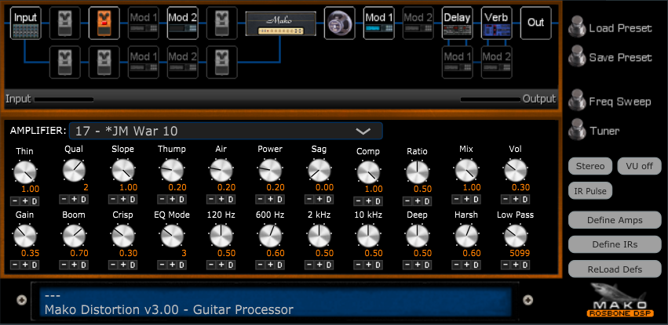

# Mako Distortion 2
* JUCE VST guitar processor.
* Tested on Windows only.
* Written in Visual C++ 2022.
* Version: 3.00
* Posted: February 5, 2025

VERSION
------------------------------------------------------------------
VERSION 2.22
* Initial release.   

VERSION2.24
* Added external amp IR file loading. 
* Included amp files in the saved PRESET file. 
* Included external amp files in ZIP. 
* Fixed Path 2 bug where paths merged too early. 
* Added Boom, Crisp, and Mix to help EQ amps before gain. 
* Added external file load to restore last used Amp and IR. 

VERSION 3.00
* Added 200 Amplifier and IR databases. 
* Improved VST operation. 
* Compressor pedal fix. 
* Tremolo pedal fix. 
* Minor UI updates. 

       
SUMMARY
------------------------------------------------------------------
A Juce/C++ VST3 guitar processor. Complete end to end processing
abilities like effects, amplifiers, EQ, etc.

This VST is under constant development and changes daily. 

THINGS TO KNOW
------------------------------------------------------------------
VST LIMITATIONS 
VST's do not save string variables. This means things like 
WAVE files used in the VST will NOT BE AVAILABLE
from within the DAW at startup or its presets. 

In order to utilize external files in the VST a database must be used.
MD2 uses an external database to store Amplifier and Speaker IR paths
so they can easily be recalled from within a DAW.

DATABASE OPERATION 
MD2 has 30 built in amplifier models and 20 built in speaker IRs.  
MD2 can access external amps and IRs if they are defined in the Amp/IR database.  

To edit the database, select the DEFINE AMPS or DEFINE IRS buttons on the main menu.
When editing, simply left mouse click to add items or right click to delete items.
Changes are automatically saved as you edit. Amps or IRs should be reselected if they
were in use while editing.

HINT: It is advised to rename the external files to the database slot they will be assigned.
Numbering the files will greatly simplify use on multiple computers. 

For example a v30 IR could be called 55_v30. When setting up the VST on another PC, it will
be easy to organize the IRs, 55_v30 needs to be loaded into slot 55.

MD2 PRESETS 
MD2 can load/save complete setups by selecting Load/Save preset buttons.
This is helpful when using the stand alone EXE. As of Version 3.00 these
functions should not be require within a DAW.

SIGNAL PATH
------------------------------------------------------------------
INPUT BLOCK 
The guitar signal begins being processed at the INPUT block. It then
moves left to right on the VST diagram. The input block has settings
for high pass filter, Attack, and Noise Gate.

The high pass filter is very important! This can be your friend when
an amp is too boomy. This filter has a gentle rolloff that can fix
boom. Another option is using one of the PreAmp based pedals before
the amp block. Or use both to get more cutoff.

Attack is used for creating Pad/Violin effects and will gradually turn
the signal volume up after a silent moment in the playing. 

The Noise Gate turns the volume down while not playing. Adjust until
no noise is heard when not playing.

PEDAL BLOCKS 
There are six possible pedal locations. These are used for things like
OverDrive, Distortion, and other gain based effects.

MODULATION BLOCKS 
There are only two available mod effects that can be used at one time. 
These blocks can be located in three different locations: before amp,
after amp, or in the effect path of a reverb/delay block.

AMPLIFIER BLOCK 
The amplifier has 200 possible channel settings. There are 30 built in amplifiers
and 170 user programmable amplifiers (database). Select an amp using the AMP drop
down list in the amplifier block.

IMPULSE RESPONSE (IR) BLOCK 
An Impulse Response is a wave file the captures the frequency response
of a system. Here they represent the speaker being used by the amplifier
block. There are adjustements here for bass/treble balance (voice) and
resampling of the IR (Size).

There are 20 programmed IRs built in to the VST. An additional 180 IRs can be added
to the IR databse. IRs can be resampled using the SIZE control. The VOICE option 
will modify the frequency response of the IR.

Voice only adds brightness to an external IR. Its default value should be 0.

DELAY AND REVERB BLOCKS 
These effects are fixed at these positions. The effects are always "ON".
To bypass the effect set its MIX value to 0 (zero).

OUTPUT BLOCK 
The final block has controls for balance, stereo effect, and output filters. 
The stereo effect (WIDTH) will delay either the left or right channel to
create stereo. 

ON SCREEN CONTROL OPERATION
------------------------------------------------------------------
There are two basic controls used for setting in MD2: Slider and knob.
- Both controls have +/- and Default buttons.
- Most controls support dragging to adjust values. Try not to drag if issues arise.
- Left click is small change, right click is large, and 3rd button maxes.
- Right click and 3rd button are based on what side of the control center you are on.
- Left/Right clicking works on the +/- buttons also.

STEREO/MONO SIGNAL PATH 
------------------------------------------------------------------
The IR calculations are very CPU intensive. This means the best mode
to operate in is MONO. This is the default mode. In this mode the signal 
on the top row of the VST diagram is mono from input to IR. The signal 
is stereo after the IR. If a stereo modulation effect is desired, place
it after the amplifier block.

When running in STEREO mode, the entire VST is in stereo. This is very CPU
intensive. There can be up to four IRs being calculated at one time. One
for input EQ and one for Speaker sim on both left and right channels. This is
1000's of calculations for each sample of the audio data.

AMPLIFIER BLOCK
------------------------------------------------------------------
The amplifier setion has 30 amps programmed. These amps can be adjusted
using the various controls. Select which amp to use with the CHAN control.

QUALITY 
Each amplifier uses a 1024 sample IR for its frequency definition. IRs
are very CPU intensive. Changing the quality reduces CPU usage by using
a small section of the IR instead of the whole IR. The tradeoff is poor
low frequency definition, which can help heavier gain sounds.

BOOM and CRISP 
Boom and Crisp are Hi/Lo cut filters to let you adjust the EQ going into the Amp.
Boom is an adjustable Low Cut filter. The Boom adjusts the steepness of the filter. 
Crisp is a typical 1st order High Cut filter. Crisp can be helpful with cleaner
amps that are distorting too much.

SLOPE 
MD2 amps use two styles of clipping: Hard and Soft. The slope control mixes
between the two types. Soft is best used for low gain and hard for high gain.

THUMP, AIR, POWER, SAG, and THIN 
Thump and Air boost the low and high freqs using a distorting circuit. 
Power adds the same distortion across the full range.  
Sag limits fast transients to simulate an amp running out of power. 
Thin compresses the signal if a lot of gain is being used. 

AMP MIX 
This control adjusts the mix betweem the driven signal and a clean signal. 
The clean signal goes thru the Amp IR process and has its EQ applied but no gain
is applied. This can be helpful on clean amps for finer control of gain by
mixing low gain with no gain.

EQ MODE AND LOW PASS 
There are 10 EQs prgrammed into the VST. Change EQs by changing the MODE
setting. The low pass is used to filter out harshness from any distortion
being used.

TIPS AND TRICKS 
Thump and Air are very useful. They are useful for most gain settings.

Sag is best used on low gain amps to soften crunch. It will reduce clarity 
on high gain amps. Best to turn it off for high gain.

Thin reduces overall gain. Its main goal is to reduce swirling ghost notes
caused by the VST having more gain that tubes are capable of doing. So thin 
is best used for super high gain amps while soloing. 

PEDAL BLOCK
------------------------------------------------------------------
There are 20 pedals programmed into the VST. Most have limited use cases.
The most important are the OverDrives and the DIST EQ pedals. These will 
let you adjust your guitar sound going into the amplifier section. Which
may be required to get the best possible sound.

To use a pedal, click on the signal flow diagram where you want the pedal
to be. There are 6 possible locations. Then select the desired pedal from
the EFFECT TYPE listbox in the settings area.

A pedal can be enabled or disabled in the settings area. You can also right
click the pedal in the signal flow diagram to toggle it on/off.

MODULATION BLOCK
------------------------------------------------------------------
There are standard style effects available here like Chorus, phaser,
flanger, etc. There are also some chorus based effects that create
pitch based sounds. There are four mono-synthesizer styled effects
available also. Three of these effects require specific WAVE files
to operate. 

To use a Mod Effect, click on the signal flow diagram where you want the Mod
to be. There are 4 possible locations. Then select the desired effect from
the  EFFECT TYPE listbox in the settings area. 

A Mod Effect can be enabled or disabled in the settings area. You can also right
click the pedal in the signal flow diagram to toggle it on/off.

DELAY BLOCK
------------------------------------------------------------------
The delay is a generic simple delay with mix, time, repeats, etc.
The offset control changes the left delay time from the right time
to create a stereo delay effect. Ducking will hold down the delay
volume while playing and increase it when not playing.

Modulation effect #1 can be placed in the delays wet mix allowing for
some interesting things like a fifth note chorus on the delay only.

REVERB BLOCK
------------------------------------------------------------------
MD2 has a very simplistic reverb based on 16 different delays being
mixed together. Reverbs 0-10 use a simpler algorithm and sound very
delay-like. Reverbs 11-19 are denser and come closer to a normal reverb
effect.

The reverb effet can be tweaked using the available controls. Specifically
room size which expands the delays in time. The low pass filter and built-in
chorus applied to the wet effect helps smooth the echoes.

Modulation Effect #2 can be applied to the wet effect. 

EXTERNAL IMPULSE RESPONSES
------------------------------------------------------------------
MD2 uses 1024 sample IRs. The program does not try to parse out WAVE
files. It assumes the first 1024 samples are the correct IR data. It
is best to verify the files in an external program before use. 

IR files are created for a certain sample rate. The VST is designed
to run at a 48 kHz sample rate. 48 kHz IR files should be used. The
frequency response of the IR is tightly tied to the sample rate. So 
the correct sample rate is very important. Once the IR is loaded into
the VST, it can be resampled using the SIZE control to get close to
its original frequency response.

Any IRs that are loaded manually have a copy saved inside the MD2
preset file, so it will not be necessary to hunt them down manually
at a later date. They will NOT be availabe from any DAW related presets.

DIALING IN AN AMPLIFIER 
------------------------------------------------------------------
The most important thing to set up is the frequencies presented to
the amplifier section. The BOOM and CRISP controls are designed to 
dial in the response of the AMP IR.

BOOMINESS 
Some amps have a lot of low end present. It may be good to reduce your
guitars low end before the amp. This can be done with the BOOM setting in the amp block.
another option is the INPUT sections HIGH PASS filter. Values in the 80-150 Hz can be very good.
some pedals have Low EQ options as well. Experiment with each as they have different slopes
and will provide varying results.

Using an OD pedal or the Dist EQ pedals will provide furtherr control and can be used to
simulate other amps by boosting gain or freqs such as mids.

CRISPY HARSHNESS 
Some amps have a lot of high freqs in them. This results in harshness
as the gain goes up. There are 6 tools that can be used.

1) Guitar tone control. Last resort?
2) CRISP control in the AMP section. Good start is .1 then move up.
3) Use a pedal (DIST EQ HI CUT) before the amp block.
4) use the LOW PASS filter in the amp block.
5) Use a smoother sounding IR.
6) Add amp sag in the AMP BLOCK.

RULES OF THUMB 
Lower gain amps will get more from low pass filters, Thump/Air, and
pregain EQ. Post amp Mid Bass and Mid EQ can help fatten thin sounds.

Higher gain amps will benefit more from less bass before the amplifier
section. Thump can add some heavy feel but the added gain from Thump,
Air, and Power may clutter up the sound. Use sparingly. Best results may
come from adjusting normal EQ settings.

MONOPHONIC SYNTHESIZER EFFECTS IN MODULATION 
------------------------------------------------------------------
This effect barely works. But when it does, it is pretty fun. Have very
low expectations or just skip them altogether.

MD2 uses a simple approach of measuring the zero crosses of the audio
data to detect the frequency being played. To do this effectively, the
signal needs to be void of harmonics. So these effects work best in 
the neck position of the guitar and may also be helped by turning down
the guitars tone control. 

The algorithm also works best from the A string to the B string. These 
tend to have less harmonics and longer waveforms that are easier to detect.

It is also best to have complete silence between notes.

The MOPHO synth generates its own synth sounds. 

The MOMO synth is the same synth that uses external wave files as its
wave forms. These files are of a single cycle of a sound being played
at 220 Hz or 440 Hz so they are in normal a tuning.

The SAMMY synth is designed to play longer samples. These samples should
also based on 220 or 440 Hz sounds. 

The HARPY synth plays longer samples also but tries to let each note
ring out completely. This is the hardest effect to use and rarely is
of any value besides fun.

Sample sizes are limited to mono and 1 million samples in size. This
is done to keep the code simple and somewhat reliable. 

TUNER AND FREQUENCY SWEEP 
------------------------------------------------------------------
A very poor tuner is supplied with MD2. But is not good. When enabled
the current note will be displayed in the bottom status window.

The frequency sweep disengages the input and completes a 20-20000 Hz
sweep of the signal path. This can be helpful to see what exactly 
certain filters are doing. 

During freq sweeps, gain should be as low as possible and effects should
be turned off. 

WARNING: The sweep is very loud! Do not damage your equipment with loud 20 Hz sounds.

ROOM EQ WIZARD - Sweeping your own amps 
------------------------------------------------------------------
Room EQ Wizard is an amazing software package that lets you make frequency sweeps. It
can be used to make amplifier IRs for use in Mako Distortion 2.

The concept of making an Amp IR is:
1) Set the amp to edge of distortion.
2) Sweep the amp at a high input volume.
3) Sweep the amp at a very low input volume.
4) The difference of those two sweeps is the input EQ response of the amp.
5) Convert the difference sweep to an IR.

QUICK GUIDE
1) Download REW, install, etc.
2) Connect your measurement devices need to drive the amp and record the amps output.
3) Set the amplifier gain so the amp is on the edge of distorting. 
4) In REW select PREFERENCES and select the input and output ports of the sound card being used.
5) Select Measure, the measurement dialog will open. Ignore calibration warnings for now.
6) Set the output LEVEL to 0 dBFS and set the NAME to 0dB.
7) Select START to sweep the amplifier. Verify nothing is clipping. Adjust if needed.
8) A sweep should be made and you should be returned to the main menu with your trace displayed.
9) Select Measure, the measurement dialog will open. Ignore calibration warnings for now.
10) Set the output LEVEL to -40 dBFS and set the NAME to 40dB.
11) Select START to sweep the amplifier.
12) A sweep should be made and you should be returned to the main menu with your trace displayed.
13) You should have two sweeps visible at the main menu.
14) Select the ALL SPL button to view both traces at once with no phase. This is a REQUIRED step.
15) Select the ACTIONS button. A dialog should appear with many buttons.
16) Select TRACE ARITHMETIC. A 2nd dialog will appear.
17) If your traces are noisey, you may choose to SMOOTH them at this point. 
18) Set the A trace to be 40dB, B Trace to be 0dB, A/B arithmetic, and select Generate button. 
19) Close the two dialogs and return to the SPL & PHASE view by selecting that button.
20) We should now only see the GENERATED trace we just created. Select ACTIONS again.
21) A smaller dialog with GENERATE MINIMUM PHASE should appear. Select that button.
22) A 2nd dialog appears, select GENERATE AND CLOSE. The phase information for the new trace should be created.
23) Close the ACTIONS dialog.
24) In the main menu under select FILE -> EXPORT -> EXPORT IMPULSE RESPONSE AS WAVE FILE.
25) Select NORMALISE and select your sample rate to 48 kHz. Continue thru to save the file. 
26) You are done with REW, however, the resulting IR wave file is not valid for use in any programs yet.
27) Start your AUDIO EDITING PROGRAM (Goldwave).

Many of these steps are not required but are presented for clarity.

This looks like a lot of steps. After doing this a couple of times and getting the hang of it, you can sweep an amplifier in a minute or two.

BEST CASE SCENARIOS AND THE NEXT LEVEL 
You may get best results when the amp EQ knobs are set pretty flat. Experiment as needed.

If you dial in the amp EQ to sound good to your ears, you can use the 0 dB sweep as your output/speaker IR. This will form a better picture of the amp.
Since we assume that the input EQ is flattened at high gain, the 0 dB sweep should be the amps output EQ/Speaker/Mics/etc. 

AUDIO EDITING SOFTWARE - Editing the REW Wave File 
------------------------------------------------------------------
The resulting wave file from REW is very large and is not valid for programs. It needs to be cropped and edited 
in an audio editing program such as Goldwave.

1) The resulting wave file will be about 512 kB with the actual IR located about 8000 samples into the wave file. 
2) Crop the wave file at the very start of the IR pulse and to at least 1024 samples after that.
3) At this point you will need to adjust for noise and errors in the sweeps if any.
4) You may wish to apply a low pass filter to remove noise above 5 kHz.
5) You may wish to apply a high pass filter to tune the bass response. 

In many situations you may have severe noise above 5 kHz. This should be filtered out. It breaks the volume of the IR and adds
terrible noise and harshness. Your guitar will also probably never create freqs above 2.5 kHz. Since you have the IR file,
you can adjust until it sounds good to your ears. 

GOLDWAVE SPECIFIC HELP 
Goldwave is a dedicated audio editor. It has a MAIN window and a CONTROL window. CONTROL lets you monitor the output of the wave file and lets 
you select sources to record from etc. The important setting here is the VU meters.

To understand what our AMP IR is doing we need to see a FREQUENCY graph of it. This can be done two ways: Play the wave file or right click in the wave file.

Right click the VU meter to select the type of meter shown. For our work we want SPECTRUM. This lets us see an FFT frequency spectrum
of the waveform being played. If set to SPECTRUM, we can right click in the Main window and see an FFT of the selected area of our wave file.

GW has 3 PLAY options. You can set the middle PLAY option to loop playback for 100 times. This lets you play the IR and get a feel for what it will sound like.
In CONTROL select the blue checkmark (Control Properties). Set PLAY 2 to SECLECTION, Loop 100.

GW has two useful filtering options that work well with IR editing: 
LOW/HIGH PASS
PARAMETRIC EQ

These two filters will let you form the IR to a useful state without destroying the phase relationship of the waveform.

The EQUALIZER destroys phase info. This can be helpful if you need more gain from the IR. IRs are normally a large pulse. By destroying the phase you 
get a more sinusoidal waveform that has an overall volume much higher than a pulse. You can get 3-6 dB more volume if needed.

GQ also has a MAXIMIZE button that lets you normalize your IR to MAX volume. This will be REQUIRED after applying filters. 

